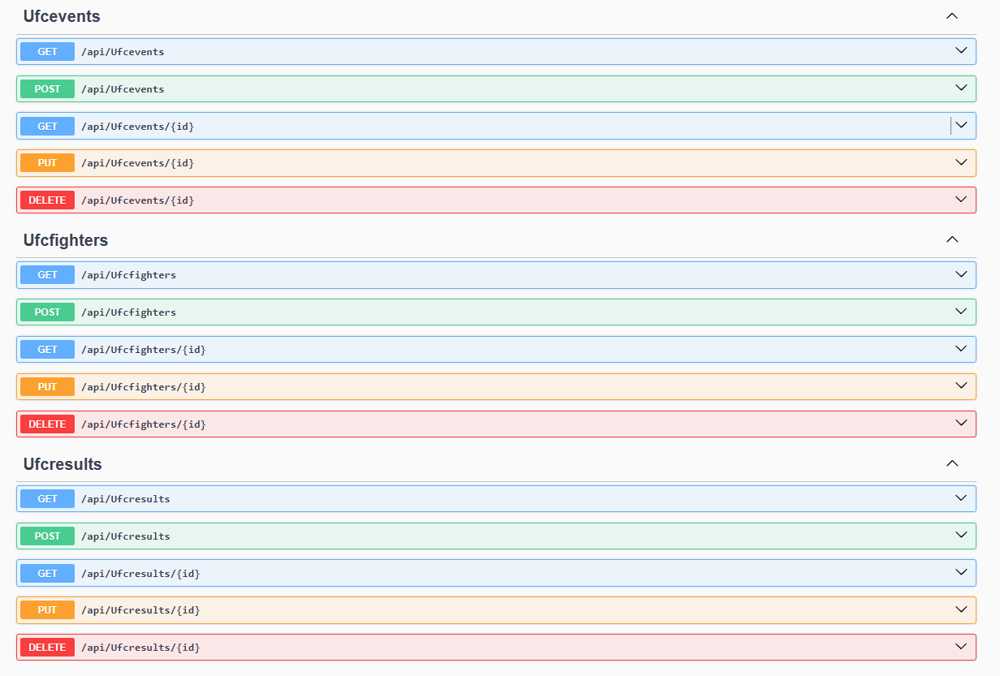
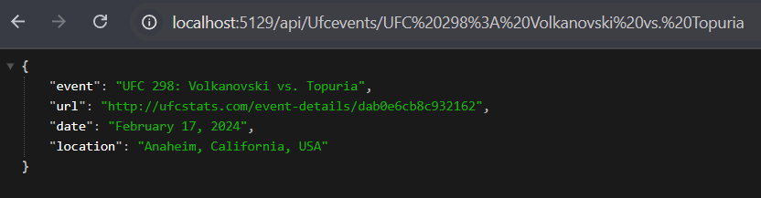
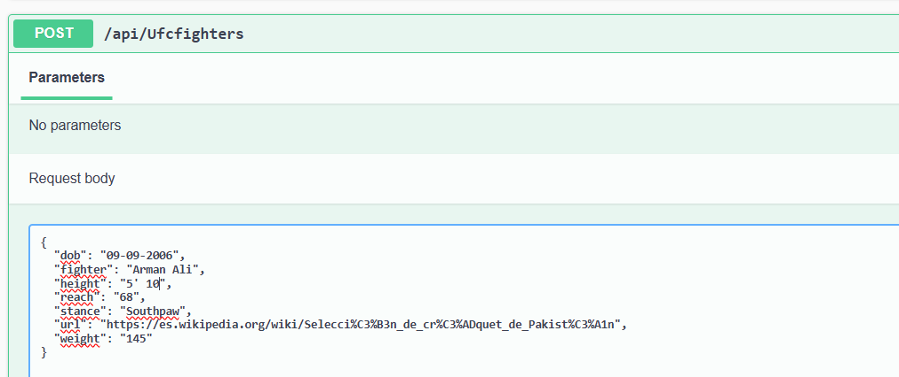
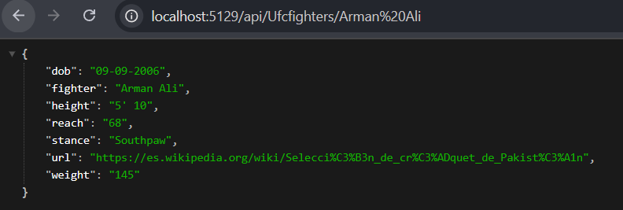
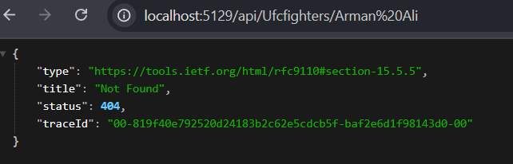
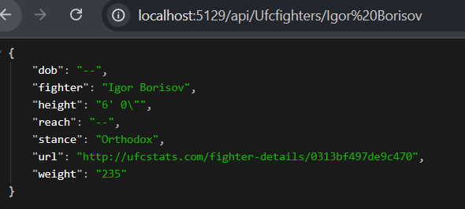
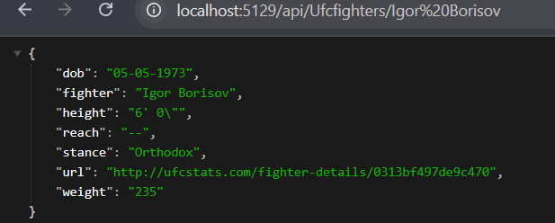

# API UFC
***En aquest projecte hem desenvolupat una API amb C#, connectada a una base de dades SQLite anomenada UFC.db. \
L’objectiu principal és poder consultar i gestionar la informació relacionada amb esdeveniments, lluitadors i resultats de la UFC.***

---
## Funcionament
El projecte es compon de les següents parts:

**Models/** → Conté les classes que representen les taules de la base de dades (Ufcevent, Ufcfighter, Ufcresult).

**Data/** → Inclou la classe *MiDbContext*, encarregada de la connexió i la gestió de la base de dades.

**Controllers/** → Conté els controladors que defineixen les rutes i operacions de cada entitat.

**Program.cs** → Configura els serveis principals (*Swagger*, DbContext, controladors) i inicia el servidor web.

**appsettings.json** → Defineix la cadena de connexió amb la base de dades SQLite.

---
## Interfície de prova amb Swagger
Mitjançant Swagger, l’API es pot provar fàcilment des del navegador. \
A l’adreça **https://localhost:5129/swagger** es mostren els tres conjunts d’operacions:

*/api/Ufcevents*

*/api/Ufcfighters*

*/api/Ufcresults*

 \
Cada secció permet executar peticions **GET**, **POST**, **PUT** i **DELETE** de forma interactiva i veure’n les respostes en format *JSON*.

Cada endpoint utilitza com a identificador únic (primary key) un camp específic:

- UFCEVENTS → EVENT (exemple: “UFC Fight Night: Ulberg vs. Reyes”)

- UFCFIGHTERS → FIGHTER (exemple: “Dominick Reyes”)

- UFCRESULTS → FIGHTERS (exemple: “Ilia Topuria vs. Charles Oliveira”)
---
#### Exemple GET UFCEVENTS per ID

1. Obrim **Swagger** a l’adreça `https://localhost:5129/swagger`.
2. A la secció **Ufcevents**, despleguem l’opció `GET /api/Ufcevents/{id}`.
3. Al camp *id*, escrivim el nom de l’esdeveniment:  
   `"UFC 298: Volkanovski vs. Topuria"`
4. Premem el botó **Execute**.
5. Swagger mostrarà la **URL generada** i el **resultat en format JSON** amb totes les dades d’aquest esdeveniment.

 

---
#### Exemple POST UFCFIGHTERS per ID

1. Obrim **Swagger** a l’adreça `https://localhost:5129/swagger`.
2. A la secció **Ufcfighters**, despleguem l’opció `POST /api/Ufcfighters/{id}`.
3. Al camp *Request body*, introduïm el següent JSON:   

 

4. Premem el botó Execute, Swagger mostrarà la URL generada per consultar aquest lluitador que s'ha creat. 

 

---
#### Exemple DELETE UFCFIGHTERS per ID

1. Obrim **Swagger** a l’adreça `https://localhost:5129/swagger`.
2. Despleguem el mètode `DELETE /api/Ufcfighters/{id}`.
3. Al camp *id*, escrivim el nom del lluitador que volem eliminar:  
   `"Arman Ali"`
4. Premem **Execute**.

---

#### Exemple PUT UFCFIGHTERS per ID

1. Obrim **Swagger** a l’adreça `https://localhost:5129/swagger`.
2. A la secció **Ufcfighters**, despleguem l’opció `PUT /api/Ufcfighters/{id}`.
3. Al camp *id*, escrivim el nom del lluitador:  
   `"Igor Borisov"`
4. Premem el botó **Execute**.
5. Swagger mostrarà la **URL generada** i el **resultat en format JSON** amb totes les dades d’aquest lluitador actualitzades.

**ABANS**

 
\
\
**DESPRÉS**

 

----
***2n DAW***  \
*Dariush Lotfi* \
*Rohit Jaswal*
